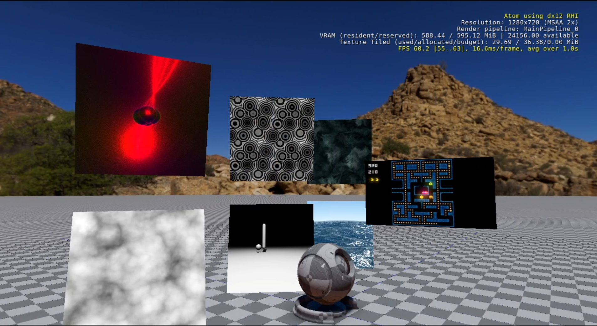

# Welcome To RenderJoy 2.0

RenderJoy is a clone of ShaderToy(https://www.shadertoy.com/) for O3DE.

*But, I don't know what's ShaderToy?* It's a very convenient sandbox to write multi-pass pixel shaders.

## Why?

1. Shaders in *ShaderToy* are written in *GLSL* (The WebGL variant). In O3DE, shaders are written in **AZSL** (A superset of *HLSL*).  
**RenderJoy** provides the same conveniences as *ShaderToy*, but from the comfort of writing the shaders in **AZSL**.  
This means you can prototype or practice **AZSL** shader development without having to write C++ code. You can design really complex
multi-pass pipelines at runtime, only limited by your imagination (and CPU/GPU memory).

2. The main renderer of O3DE is ATOM. ATOM is modular and data-driven, allowing developers to create custom render pipelines with ease.  
**RenderJoy** is an opportunity to showcase such flexibility.

3. Starting with **RenderJoy 2.0** you can now render as many shader effects as your machine can take. Each shader effect can run indenpendently as billboards floating in the main viewport of O3DE. This is really great to compare and debug (with WinPix or RenderDoc) the performance of several shaders running concurrently. Here is a screenshot of 7 shader effects, each one rendering into its own billboard...  




---

## Installation & Setup

After cloning this repository, you'll find two subdirectories:  
*DemoProject/*  
*Gem/*  
  
At its core **RenderJoy** is a Gem, so at a minimum you'll only need to register the Gem, and enable it in your other game projects.  
  
*Optionally*, you can use the sample game project, **RenderJoyDemoProject**,  provided inside the *DemoProject/* folder. This game project contains several sample levels. Some of the examples are a straight port from *ShaderToy*, like being able to play *PacMan* (https://www.shadertoy.com/view/Ms3XWN) :grin:  
  
  
For the sake of simplicity, the following instructions assume you have installed *O3DE* at **D:\GIT\o3de\**,  
and **RenderJoy** was cloned in **E:\Other\RenderJoy**.


### Using The Companion RenderJoyDemoProject
This is the easiest way to compile the O3DE Editor and start using RenderJoy, or checking out the Level demos that come with **RenderJoyDemoProjecy**.  
1. `cd D:\GIT\o3de`  
2. Register the provided demo project, **RenderJoyDemoProject**.  
`.\scripts\o3de.bat register -pp E:\Other\RenderJoy\DemoProject`
3. `cd E:\Other\RenderJoy\DemoProject`
4. Generate the Visual Studio solution to compile the Editor (This example assumes VS2022).
The following *cmake* configuration command assumes your 3rdParty folder is located at: **D:\LY3RDPARTY\lyengine\3rdParty**  
`cmake -B build -S . -G "Visual Studio 17" -DLY_3RDPARTY_PATH=D:\LY3RDPARTY\lyengine\3rdParty`  
OR  
If you use the default 3rdParty folder, then this command should suffice:  
`cmake -B build -S . -G "Visual Studio 17"`
5. Build the Editor.  
Compile the *Editor* target using the generated solution at *'.\build\RenderJoyDemoProject.sln'*

### Using RenderJoy With Other Game Projects

1. Register the RenderJoy Gem.  
`cd D:\GIT\o3de`  
`.\scripts\o3de.bat register -gp E:\Other\RenderJoy\Gem`  
  
2. Enable the **RenderJoy** Gem.  
Assuming your particular game project is located at: **D:\MyProjects\SecretProject**:  
Edit **project.json**, which in this example will be located at **D:\MyProjects\SecretProject\project.json** and add **"RenderJoy"** to the **"gem_names"** array. Here is a snippet:
```json
    ...
    "gem_names": [
        "Atom",
        "AtomLyIntegration",
        "Camera",
        ...
        More Gems 
        ...
        "RenderJoy",
    ],
    ...
```

  
3. Generate the Visual Studio solution to compile the Editor 
`cd D:\MyProjects\SecretProject`  
The following *cmake* configuration command assumes your 3rdParty folder is located at: *"D:\LY3RDPARTY\lyengine\3rdParty\"*  
`cmake -B build -S . -G "Visual Studio 17" -DLY_3RDPARTY_PATH=D:\LY3RDPARTY\lyengine\3rdParty`  
OR  
If you use the default 3rdParty folder, then this command should suffice:  
`cmake -B build -S . -G "Visual Studio 17"`  
  
5. Build the Editor.  
Compile the *Editor* target using the generated solution at *'.\build\SecretProject.sln'*, or equivalent.  

Go to the Wiki for instructions on how to write shaders for RenderJoy:  
https://github.com/lumbermixalot/RenderJoy/wiki  


